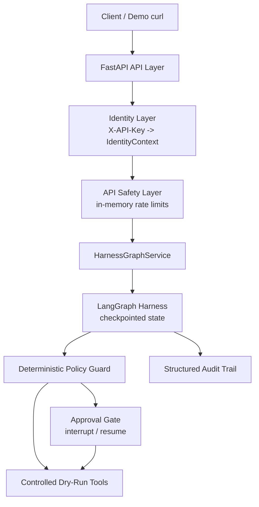
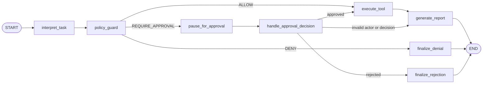

# Architecture

## Project Principle

The LLM proposes. The harness decides.

## Core Safety Invariant

Identity is server-derived, policy is deterministic, and high-risk execution cannot happen before approval.

## V1 Framing

V1 uses deterministic task interpretation to prove the harness. An LLM can later replace the proposer without changing the identity, policy, approval, execution, or audit layers.

This means the architecture is centered on execution control, not conversation.

## Layered Architecture



## Module Map

- `src/app/identity/`: demo API-key identity resolver and identity schemas.
- `src/app/tools/`: dry-run tool registry and controlled tool functions.
- `src/app/policy/`: deterministic policy guard.
- `src/app/approval/`: approval request and decision schemas.
- `src/app/audit/`: structured audit event schemas and helpers.
- `src/app/state/`: task lifecycle status schemas.
- `src/app/graph/`: LangGraph nodes, routing, builder, state, and service wrapper.
- `src/app/api/`: FastAPI routes, public response schemas, dependencies, and in-memory rate limiter.
- `tests/`: focused tests for each layer and cross-layer API behavior.

## Graph Flow



Unknown tasks are marked `failed` and routed to report generation without tool execution.

## Approval Resume Flow

When policy requires approval:

```text
pause_for_approval
-> create ApprovalRequest
-> checkpoint state
-> interrupt before high-risk execution
```

On resume:

```text
Command(resume={ approval_decision, approval_actor })
-> validate approval decision and actor
-> approved: execute dry-run tool
-> rejected: finalize rejection
-> invalid actor/decision: fail safely
```

Admin does not bypass approval. High-risk tools never return direct allow from policy.

## Identity Boundary

Identity is server-derived from `X-API-Key`.

Clients cannot set or override:

- user ID
- role
- scopes
- API key ID

Request body fields that look like identity claims do not affect execution identity.

## Policy Boundary

Policy is deterministic and lives outside the API routes.

The policy guard decides:

- allow
- deny
- require approval

The policy layer does not execute tools. The tool layer does not authorize.

## API Boundary

The API layer stays thin:

```text
route
-> get_current_identity dependency where identity is required
-> rate-limit dependency for protected write routes
-> HarnessGraphService
-> response schema
```

API routes must not:

- trust role/scopes/user_id from request bodies
- inspect role/scopes manually
- evaluate policy manually
- execute tools manually
- create approval decisions outside the service/graph boundary

Approval and rejection routes delegate to `HarnessGraphService`. The audit route reads structured audit events through the same service boundary.

## Rate Limiting Boundary

Sprint 8 added local/demo rate limiting for public safety.

Rate limiting:

- runs after identity resolution
- is keyed from server-derived `api_key_id` plus route group
- protects task creation and approval/rejection actions
- returns `429` when a protected route exceeds its limit
- is in-memory and process-local
- resets on process restart

It does not alter graph policy, approval, or execution semantics.

## State and Persistence

Current checkpointing uses LangGraph `InMemorySaver`.

This means:

- task state is process-local
- checkpoints do not survive process restart
- paused tasks can be resumed only while the process is alive
- audit events are not durably stored
- database-backed task storage is not implemented

## V2 Extension Points

Future versions can replace or extend layers without changing the core invariant:

- proposer: deterministic interpreter -> LLM planner
- identity: demo API key -> OAuth/OIDC and JWT validation
- checkpointing: `InMemorySaver` -> SQLite/Postgres checkpointing
- task store: process memory -> durable task database
- rate limiting: in-memory fixed window -> Redis/API gateway/platform limits
- tools: dry-run adapters -> real external tool adapters behind stronger controls
- observability: local tests/docs -> tracing and production telemetry

## V1 Non-Goals

- OAuth/OIDC
- JWT validation
- Redis or distributed rate limiting
- database persistence
- SQLite checkpointing
- LLM/OpenAI calls
- real GitHub writes
- real workflow triggers
- frontend dashboard
- multi-agent behavior
- production deployment hardening
