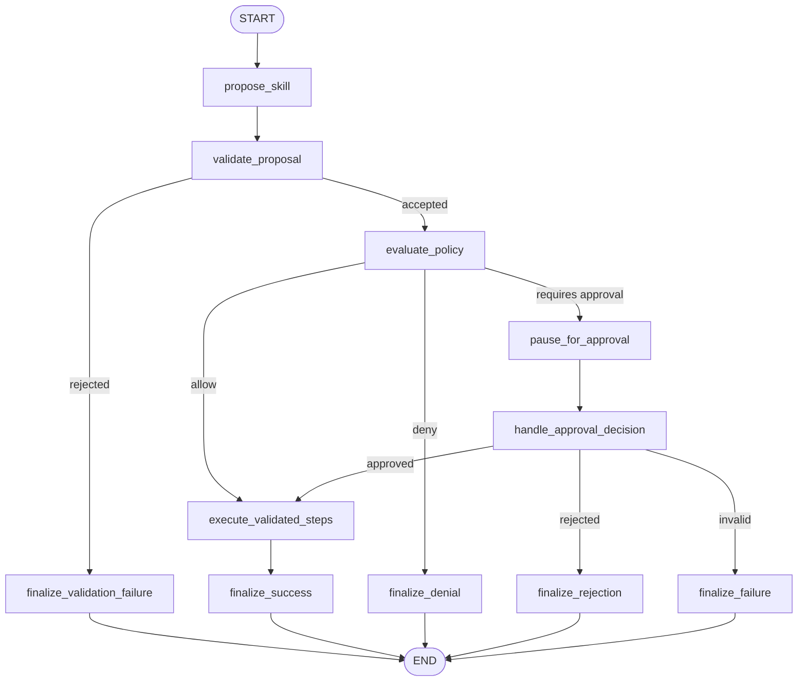

# Architecture

## Project Principle

```text
The LLM proposes.
The harness validates, authorizes, approval-gates, executes, and audits.
```

## Core Safety Invariant

```text
Identity is server-derived, policy is deterministic, and high-risk execution cannot happen before approval.
```

Artifact 1 applies that invariant to model-shaped skill proposals.

## Artifact 1 / Artifact 2 Flow

```text
Client/task
-> proposer
-> SkillProposal
-> ProposalValidator
-> validated scalar arguments
-> SkillRegistry
-> policy guard
-> approval gate
-> dry-run ToolRegistry / fake GitHub client
-> audit
-> SkillRunResult
```

## Layer Responsibilities

- Client/task: supplies the user task text.
- Proposer: produces an untrusted `SkillProposal`.
- `SkillProposal`: structured proposed skill ID, version, rationale, and steps.
- `ProposalValidator`: deterministic gate for proposal validity.
- `SkillRegistry`: trusted registry of allowed skills, steps, tools, scopes, and risk.
- Policy guard: deterministic authorization over server-derived identity and tool metadata.
- Approval gate: checkpointed human decision point for high-risk execution.
- `ToolRegistry`: controlled dry-run tool execution only.
- Audit: structured evidence trail for important decisions and actions.
- `SkillRunResult`: final run outcome and dry-run tool results.

## Module Map

- `src/app/identity/`: demo API-key identity resolver and identity schemas.
- `src/app/tools/`: dry-run tool registry and controlled tool functions.
- `src/app/github/`: GitHub issue-comment protocol, schemas, and fake client.
- `src/app/side_effects/`: side-effect id helpers and in-memory ledger.
- `src/app/policy/`: deterministic policy guard.
- `src/app/approval/`: approval request and decision schemas.
- `src/app/audit/`: structured audit event schemas and helpers.
- `src/app/skills/`: skill contracts, default registry, and proposal validator.
- `src/app/proposer/`: proposer protocol, fake proposer, and optional LLM proposer boundary.
- `src/app/skill_graph/`: Artifact 1 skill execution graph and service.
- `src/app/graph/`: inherited deterministic task graph still used by current FastAPI task routes.
- `src/app/api/`: inherited local/demo FastAPI task API, dependencies, and rate limiter.
- `tests/`: focused tests for each layer and cross-layer behavior.

## Skill Execution Graph



## Proposal Boundary

The proposer is not trusted.

`FakeProposer` creates deterministic proposals for local tests and demos.
`LLMProposer` can parse output from an injected client, but tests use mocked
client output only.

The proposer must not:

- authorize
- approve
- execute tools
- bypass validation
- invent trusted tools
- decide final risk
- decide final approval requirement

Malformed LLM output becomes a malformed proposal with evidence in the rationale
and is rejected by validation.

## Validation Boundary

`ProposalValidator` treats model output like an external API request.

It checks:

- skill ID is registered
- skill version is supported
- steps are present
- step IDs are unique
- proposed steps exist in the registered skill
- proposed tool names match registered step metadata
- identity has required scopes
- proposed risk does not understate registry risk

It derives final required scopes, risk level, and approval requirement from the
registry, not from the model.

## Registry Boundary

`SkillRegistry` is trusted metadata.

It defines which skills and steps exist, which tools each step may use, which
scopes are required, and which risk level applies.

`ToolRegistry` is the controlled execution boundary. It exposes dry-run tools
only and does not authorize by itself.

## Policy Boundary

Policy is deterministic and lives outside routes and outside the model.

The policy guard decides:

- allow
- deny
- require approval

The policy layer does not execute tools. The tool layer does not authorize.

## Approval Boundary

High-risk validated proposals pause before execution.

The graph creates an approval request, checkpoints state with `InMemorySaver`,
and waits for a resume command.

On resume:

```text
approved -> execute dry-run tool
rejected -> finalize without execution
invalid actor/decision -> fail safely without execution
```

Admin identity does not bypass approval.

## Audit Boundary

Audit events record:

- task/run creation
- skill proposal produced
- proposal validation completed
- permission checks
- approval requested
- approval granted
- approval rejected
- tool executed
- task/run completed or failed

Audit state is in memory and process-local.

## API Boundary

The FastAPI routes expose the inherited deterministic task API from Artifact 0
and the Artifact 1.1 skill-runner API surface.

Task routes wrap `HarnessGraphService` from `src/app/graph/`. Skill-run
creation, read, approval, rejection, and audit routes wrap `SkillGraphService`
from `src/app/skill_graph/`.

The default HTTP skill-runner path uses fake proposer mode. HTTP
`proposer_mode: "llm"` is disabled and returns `400 Bad Request` without calling
a live model provider. The optional `LLMProposer` boundary remains internal and
is tested with mocked clients.

Invalid proposal, high-risk approval, high-risk rejection, and approved
high-risk audit behavior are covered by API tests using scenario-configured fake
proposer injection. The default running HTTP API does not currently expose a
public request field for selecting those fake proposer scenarios.

FastAPI routes must not:

- trust role, scopes, user ID, or API key ID from request bodies
- inspect role/scopes manually for authorization
- evaluate policy manually
- execute tools manually
- create approval semantics outside service/graph boundaries

## State And Persistence

Current checkpointing uses LangGraph `InMemorySaver`.

This means:

- state is process-local
- checkpoints do not survive process restart
- paused work can resume only while the process is alive
- audit events are not durably stored
- database-backed task/run storage is not implemented

## Tool Argument Limitation

Skill specs include argument-schema metadata. Artifact 1.2 validates
model-proposed runtime arguments into `ValidatedSkillPlan`, and the skill
execution graph passes accepted scalar arguments to registered tools.

Artifact 2 uses that scalar argument boundary for the one local/demo
`post_github_issue_comment` path. Only validated `repository`, `issue_number`,
and `comment_body` values can reach the fake-client execution boundary.

Current argument limits remain:

- scalar string/integer/boolean values only
- no object/list/nested argument support
- no arbitrary JSON payload validation
- no partial acceptance of mixed valid and invalid argument plans

## GitHub Comment Side-Effect Boundary

Artifact 2 adds one approval-gated fake-client GitHub issue-comment path:

```text
post_github_issue_comment
```

The path adds:

- repository allowlist policy
- high-risk approval gate
- `validated_arguments_hash`
- deterministic `side_effect_id`
- `InMemorySideEffectLedger`
- `FakeGitHubIssueCommentClient`
- GitHub-comment audit evidence

This is local/demo simulated execution. The architecture does not include a
real GitHub client, token loading, real network calls, durable audit storage,
or durable ledger storage.

## Non-Goals

- new API endpoints
- OAuth/OIDC
- JWT validation
- MCP
- database persistence
- durable audit storage
- real GitHub writes
- real workflow triggers
- frontend
- production deployment
- multi-agent behavior
